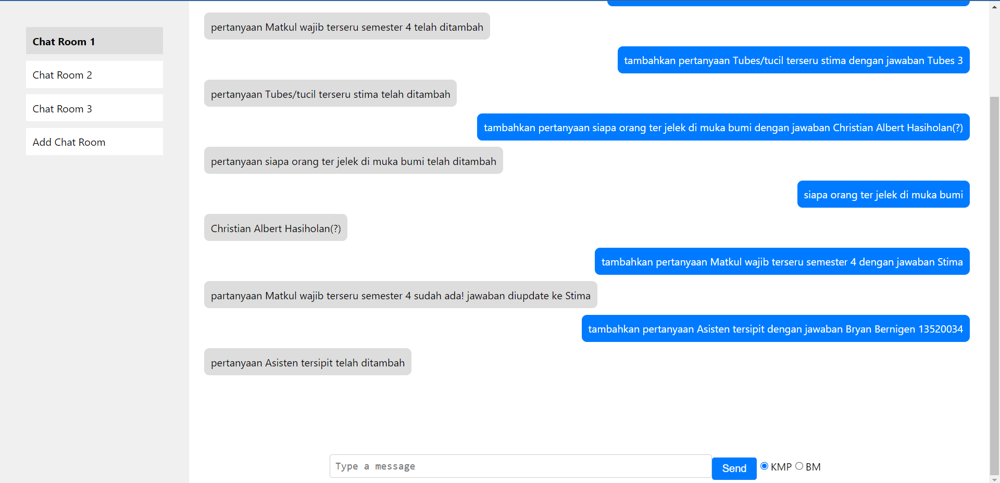

# Tugas Besar 3 IF2211 Strategi Algoritma Kelompok 24 GyrosPallas

  <strong>Penerapan String Matching dan Regular Expression dalam Pembuatan ChatGPT Sederhana</strong> 

> Live demo [_here_](https://www.example.com). <!-- If you have the project hosted somewhere, include the link here. -->

## Table of Contents
* [Deskripsi](#deskripsi)
* [Struktur Folder](#struktur-folder)
* [Program Environment](#program-environment)
* [Features](#features)
* [Screenshots](#screenshots)
* [Setup](#setup)
* [Usage](#usage)
* [Project Status](#project-status)
* [Room for Improvement](#room-for-improvement)
* [Acknowledgements](#acknowledgements)
* [Contact](#contact)
<!-- * [License](#license) -->

## Deskripsi
Tugas besar ketiga IF2211 - Strategi Algoritma adalah penerapan algoritma String Matching dan Regular Expression dalam pembuatan ChatGPT (chat bot) sederhana.

## Struktur Folder
1. `src` berisi source code dari tugas besar 3.
2. `doc` berisi laporan tugas besar 3.

## Program Environment
- Visual Studio Code
- Node.js (v18.16.0)
- Node Package Manager (9.5.1)
- Go Programming Language (go1.20.4 windows/amd64)

## Features
- Text Questions (from database)
- Calculator
- Date
- Add Questions and Answers to Database
- Erase Question from Database

## Screenshots

<!-- If you have screenshots you'd like to share, include them here. -->

## Setup
1. make sure port 3001 is not being used or change the port inside `src/frontend/src/ChatRoom.js` and `src/backend/test.go` to the port you're about to use for backend server.
2. run `initFrontend` or run the script inside it in your computer terminal.
3. run `runBackend` or run the script inside it in your computer terminal, then press "Yes" to the firewall popup.
4. run `runFrontend` or run the script inside it in your computer terminal, then go to http://localhost:3000 or your used port for frontend.

## Usage
- Send any type of question in text format to ask a question.
- Send text in `hitung ([0-9]['(',')','+','-','/','*'])*` format to use the calculator.
- Send text in `hari apa (dd/mm/yyyy)` format to ask what day it is at that time.
- Send text in `tambahkan pertanyaan (question) dengan jawaban (answer)` format to add questions and answers to the database.
- Send text in `hapus pertanyaan (question)` to erase question and it's answer from the database.

## Project Status
Project is: _no longer being worked on_. reason: The project has passed the deadline.

## Room for Improvement

Room for improvement:
- Improve Calculator.
- Improve UI design.
- Improve Chat History database.

## Acknowledgements
Give credit here.
- This project was inspired by [ChatGPT](https://chat.openai.com).
- This project was based on [this specification](https://informatika.stei.itb.ac.id/~rinaldi.munir/Stmik/2022-2023/Tubes3-Stima-2023.pdf).

## Contact
Created by:
- [Tobias Natalio Sianipar - 13521090](https://github.com/tobisns)
- [Haidar Hamda - 13521105](https://github.com/haidarhamda)
- [Ammar Rasyad Chaeroel - 13521136](https://github.com/ammarasyad)
